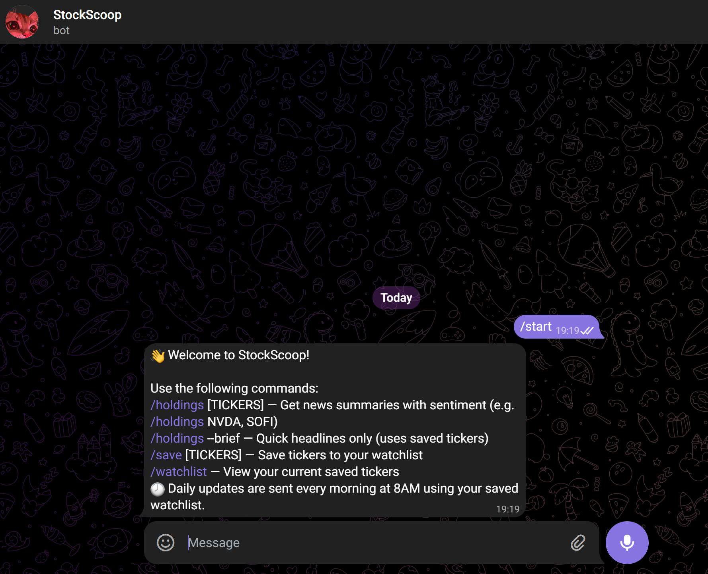
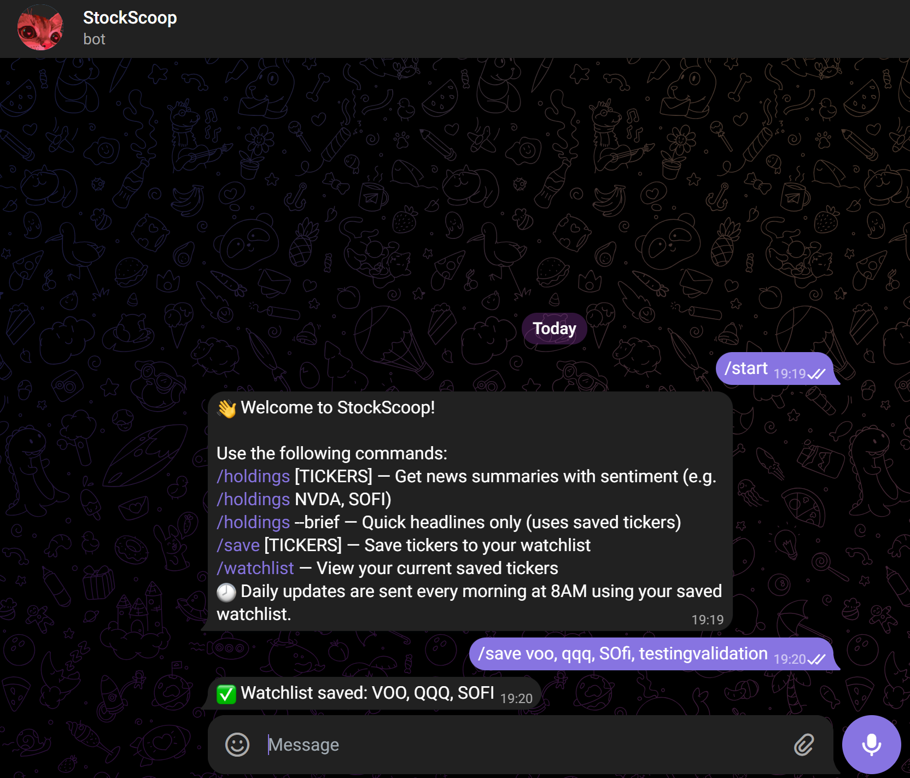
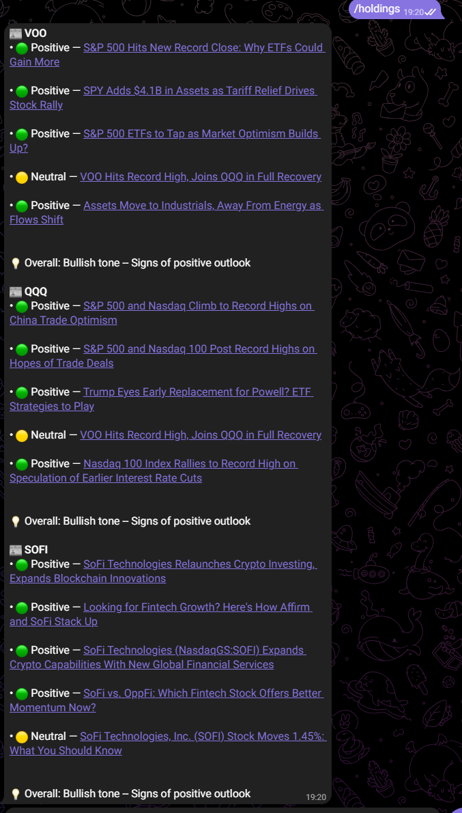

# 📰 StockScoop | Your Personal Telegram Stock News Assistant

StockScoop is a Telegram bot that fetches and analyzes the latest news for stocks you care about. It uses sentiment analysis to summarize headlines and help retail investors cut through noise like clickbait articles, making it easier to stay updated.

---

## Features

- 📩 **Telegram Bot**: Interact directly using `/commands`
- 📰 **Real-Time News**: Pulls latest RSS feeds from Yahoo Finance, CoinDesk, and more
- 🧠 **Sentiment Analysis**: Uses VADER to rate news as Positive, Neutral, or Negative
- 🗂️ **Watchlist Support**: Save tickers to your watchlist and check news anytime
- 🕗 **Daily Briefings**: Automatically sends summaries of your watchlist every morning
- 📎 **Brief Mode**: Toggle a mode with no analysis for just the headlines

---

## 🔧 How it Works

- Built with Python and the `python-telegram-bot` library
- News is pulled via RSS feeds from selected credible financial news websites 
- Headlines + descriptions are run through VADER sentiment analysis
- Results are summarized with emojis and tone suggestions

---

## 📦 Tech Stack

- Python
- `python-telegram-bot`
- `vaderSentiment`
- `APScheduler` (for daily updates)
- JSON-based persistence (MVP will update with SQLite Database in future.)

---

## 📸 Demo

> ### Welcome Message


### Saving Watchlist


### News with Sentiment


---

## Future Plans

- Replace JSON with SQLite for multi-user support
- Smarter filtering of clickbait / irrelevant articles
- Upgrade logic with NLP/ML-based context-aware summarization
- Deploy on Render or Railway (once user DB is implemented)
- Add multi-user scheduling + Telegram auth

---

## Security

API tokens are excluded using `.gitignore`, and `os.environ.get()` is used to securely read them during deployment (e.g., via Render’s environment variables).

---

## Run Locally

```bash
git clone https://github.com/Tiltedddddd/StockScoop.git
cd StockScoop
pip install -r requirements.txt
python bot.py
```

> Create a `config.py` file locally with:
```python
TELEGRAM_BOT_TOKEN = "your_token_here"
```

---

## My Notes

This MVP is still being actively developed. I decided not to host it yet as I’m improving the sentiment engine, adding real persistence, and making it more user-ready. But I wanted to share this version as part of my learning.
